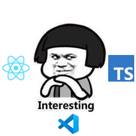

# React Tsx Hooks Snippets

React Tsx Hooks Snippets 是一个 VS Code 代码片段扩展，提供 React、React Hooks、Redux 和 TypeScript/TSX 常用模板。扩展支持 `typescript` 和 `typescriptreact` 文件。



## 功能特性

- 提供 React 函数组件、类组件、memo 组件和 PureComponent 模板。
- 提供 React 19 Hooks 片段：`useState`、`useEffect`、`useActionState`、`useOptimistic`、`useTransition`、`useSyncExternalStore` 等。
- 提供 Redux 常用片段：action、reducer、selector、`useDispatch`、`useSelector`、connect 类组件。
- 提供 TypeScript 导出片段：`interface` 和 `type`。

## 使用方式

在 `.ts` 或 `.tsx` 文件中输入片段前缀，然后选择 VS Code 提示项并按 `Tab` 或 `Enter` 展开。

示例：

```tsx
// 输入 rafcts 展开 React TSX 函数组件
const ${1:${TM_FILENAME_BASE}} = (props: Props) => {
  return (
    <div>
      $0
    </div>
  )
}
```

## 片段列表

### React

| 前缀 | 名称 | 说明 |
| --- | --- | --- |
| `rafcts` | ReactArrowFunctionComponentTypeScript | React 箭头函数组件 |
| `rfcts` | ReactFunctionComponentTypescript | React 函数组件 |
| `rfmcts` | ReactFunctionMemoComponent | React memo 函数组件 |
| `rccts` | ReactClassComponentTypeScript | React TypeScript 类组件 |
| `rcpcts` | ReactClassPureComponent | React PureComponent 类组件 |
| `imr` | ImportReact / ImportReactComponent | 导入 React 或 React Component |
| `imhall` | ImportHooksAll | 导入常用 React Hooks |
| `imhs` | ImportReactHooksState / Effect | 导入 `useState` 或 `useState/useEffect` |
| `bnd` | BindThis | 绑定 class method 的 `this` |
| `ctp` | DestructProps | 解构 `this.props` |
| `cts` | destructState | 解构 `this.state` |

### Hooks

| 前缀 | 片段 |
| --- | --- |
| `uss` | `useState` |
| `use` | `useEffect` |
| `usle` | `useLayoutEffect` |
| `uscb` | `useCallback` |
| `usmm` | `useMemo` |
| `usref` | `useRef` |
| `usctx` | `useContext` |
| `usrdcer` | `useReducer` |
| `usimphd` | `useImperativeHandle` |
| `usdbgv` | `useDebugValue` |
| `usactst` | `useActionState` |
| `usdfrv` | `useDeferredValue` |
| `useevt` | `useEffectEvent` |
| `usid` | `useId` |
| `usinsfx` | `useInsertionEffect` |
| `usopt` | `useOptimistic` |
| `ussxstr` | `useSyncExternalStore` |
| `ustrs` | `useTransition` |
| `usfmsts` | `useFormStatus` (`react-dom`) |

### Redux 与 TypeScript

| 前缀 | 名称 | 说明 |
| --- | --- | --- |
| `imrdxhk` | ImportReduxHooks | 导入 Redux hooks |
| `usdpch` | useDispatch | `react-redux` 的 `useDispatch` |
| `ussltor` | useSelector | `react-redux` 的 `useSelector` |
| `rdxact` | ReduxAction | Redux action |
| `rdxrdcer` | ReduxReducer | Redux reducer |
| `rdxsltor` | ReduxSelector | reselect selector |
| `rcrdxts` | React Redux Class Component | connect 类组件 |
| `expinf` | ExportInterface | 导出 interface |
| `exptp` | ExportType | 导出 type |

## 开发与构建

片段源码位于 `example/` 目录，按 `react/`、`redux/`、`typescript/` 分类。构建脚本 `compiler.js` 会读取示例文件中的元数据并生成 `snippets/snippets.json`。

```bash
npm run build
```

新增片段时，请在 `example/` 下创建 `.tsx` 文件，并在文件顶部添加：

```tsx
// @name: SnippetName
// @prefix: prefix
// @description: Snippet description
```

随后运行 `npm run build`，并在 VS Code Extension Host 中验证展开效果。

## English

React Tsx Hooks Snippets is a VS Code snippets extension for React, React Hooks, Redux, and TypeScript/TSX. It contributes snippets to both `typescript` and `typescriptreact` files.

### Features

- React component templates for function components, class components, memo components, and PureComponent.
- React 19 Hooks snippets, including `useState`, `useEffect`, `useActionState`, `useOptimistic`, `useTransition`, and `useSyncExternalStore`.
- Redux snippets for actions, reducers, selectors, `useDispatch`, `useSelector`, and connected class components.
- TypeScript export snippets for `interface` and `type`.

### Usage

Type a snippet prefix in a `.ts` or `.tsx` file, then select the VS Code suggestion and press `Tab` or `Enter`.

Common prefixes:

- React components: `rafcts`, `rfcts`, `rfmcts`, `rccts`, `rcpcts`
- Hooks: `uss`, `use`, `usle`, `uscb`, `usmm`, `usref`, `usctx`, `usrdcer`, `usactst`, `usopt`, `ustrs`
- React 19 / DOM hooks: `usdfrv`, `useevt`, `usid`, `usinsfx`, `ussxstr`, `usfmsts`
- Redux: `rdxact`, `rdxrdcer`, `rdxsltor`, `usdpch`, `ussltor`
- TypeScript: `expinf`, `exptp`

### Development

Snippet sources are stored in `example/`. Run the build command to regenerate `snippets/snippets.json`:

```bash
npm run build
```

To add a snippet, create a `.tsx` file under the relevant `example/` subdirectory, include the `@name`, `@prefix`, and `@description` comments, then rebuild and test the prefix in the VS Code Extension Host.
